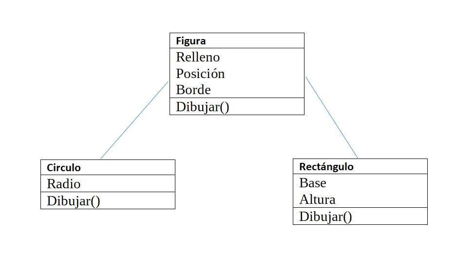

# Herencia
## 1.  Define: Clase Base, Clase Derivada.
#### **Clase Base:** Es la clase original la cual va a heredar a otras clases.  
#### **Clase Derivada:** Es la clase que hereda de la clase base
## 2. Haz un diagrama UML donde se muestre la relación de herencia entre las  clases Figura, Recangulo y Circulo como vimos en clase.

## 3. ¿ Indica cuales son las clases base y las derivadas.
#### Figura es la clase base y las otras son derivadas.
## 4. ¿Que es herencia simple y herencia múltiple? ¿En c# se puede hacer herencia múltiple?
#### La herencia simple es cuando una clase hereda a otra sus atributos y metodos.  
#### La herencia multiple es cuando una clase hereda atributos y metodos de mas de una clase. 
#### C# no admite la herencia multiple.
## 5. Escribe el programa de Figura como vimos en clase, donde agregues varios tipos de figuras a una lista y recorre la lista llamando a un metodo de las figuras, además :
## 5.1 Se sobrecarguen los constructores y se acceda a los constructores de la clase base 
## 5.2 Explica para que nos sirve la palabra base
#### Sirve para poder acceder a a los metodos de la base.
## 5.3  Haz el método Dibuja() que sea virtual y redefinelo en solo una de las clases derivadas.  